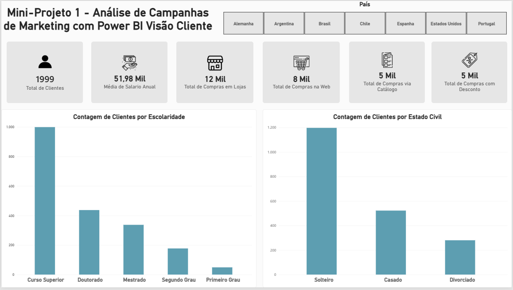
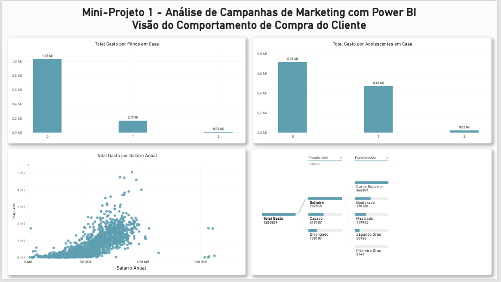
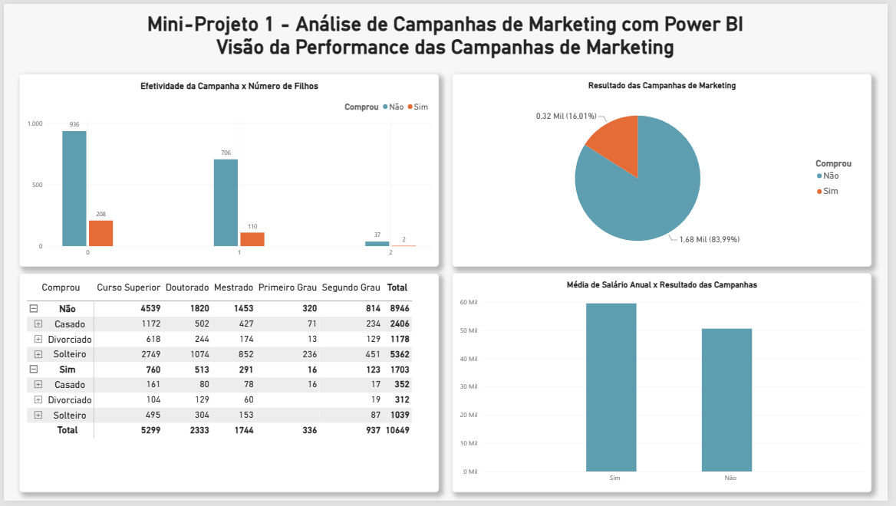
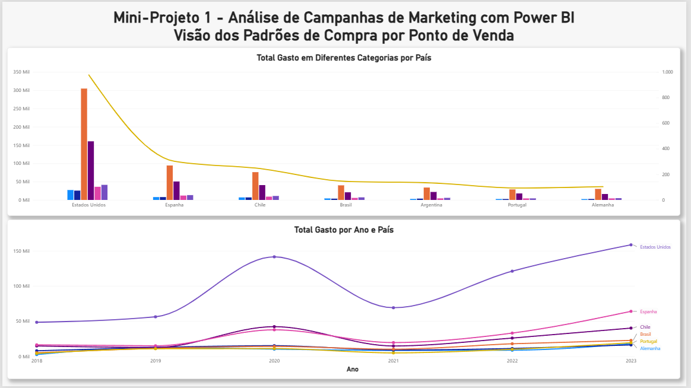

📊 Análise de Campanhas de Marketing com Power BI

🎯 Sobre o projeto

Mini-projeto desenvolvido durante minha formação em Análise de Dados na Data Science Academy (DSA), utilizando o Power BI para analisar o comportamento de clientes, padrões de compra e desempenho de campanhas de marketing.

O projeto busca explorar diferentes características dos clientes e seus hábitos de consumo, permitindo analisar informações relacionadas a perfil, gastos, canais de compra, campanhas de marketing e distribuição das vendas entre diferentes países.

🛠️ Ferramenta utilizada
- Power BI Desktop

📈 Análises realizadas

O projeto foi dividido em diferentes visões para facilitar a análise dos dados.

👤 Visão do Cliente

Análise das características e do perfil dos clientes, considerando:

- Total de clientes;
- Média de salário anual;
- Compras realizadas em lojas;
- Compras realizadas pela web;
- Compras realizadas por catálogo;
- Compras realizadas com desconto;
- Distribuição dos clientes por escolaridade;
- Distribuição dos clientes por estado civil;
- Análise por país.

🛒 Visão do Comportamento de Compra

Análise do comportamento de consumo dos clientes considerando:

- Gastos relacionados à quantidade de filhos em casa;
- Gastos relacionados à quantidade de adolescentes em casa;
- Relação entre salário anual e total gasto;
- Distribuição do total gasto considerando estado civil e escolaridade.

📣 Visão da Performance das Campanhas

Análise dos resultados das campanhas de marketing, considerando:

- Efetividade das campanhas;
- Quantidade de clientes que realizaram compras após as campanhas;
- Resultado geral das campanhas;
- Relação entre escolaridade, estado civil e resultado das campanhas;
- Média de salário anual de clientes que compraram e não compraram.

🌎 Visão dos Padrões de Compra

Análise dos padrões de consumo por país e período, considerando:

- Total gasto em diferentes categorias por país;
- Comparação entre países;
- Evolução do total gasto ao longo dos anos.
  
📊 Visualizações utilizadas

Foram utilizadas diferentes visualizações do Power BI para facilitar a exploração dos dados:

- Gráficos de barras;
- Gráfico de dispersão;
- Gráfico de linhas;
- Gráfico combinado de colunas e linhas;
- Gráfico de pizza;
- Matriz;
- Indicadores (Cards);
- Segmentações por país.
  
🎛️ Interatividade

O dashboard permite explorar os dados por diferentes perspectivas, incluindo:

- Países;
- Perfil dos clientes;
- Comportamento de compra;
- Período;
- Resultado das campanhas.

🖼️ Dashboard

👤 Visão do Cliente

🛒 Visão do Comportamento de Compra

📣 Visão da Performance das Campanhas

🌎 Visão dos Padrões de Compra

🎓 Contexto

Projeto desenvolvido como parte dos estudos e da formação em Análise de Dados na Data Science Academy (DSA).

## 👨‍💻 Autor

**Vinicius Marques**

Análise e Desenvolvimento de Sistemas | Power BI | Excel | SQL | Análise de Dados
